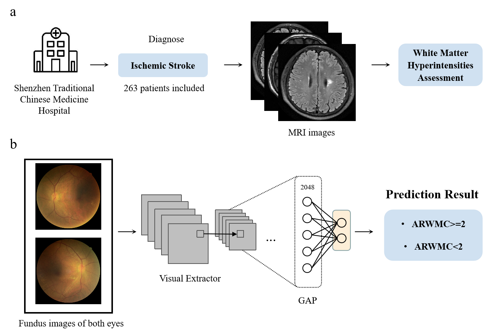
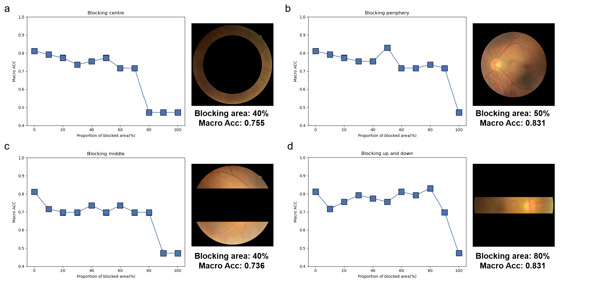

# Binocular-Fundus-Images-ARWMC-Evaluation

Prediction of ARWMC using GAP based feature fusion of binocular fundus images.

Based on PyTorch, run train_img_pair.py.

The model code is located in fusion_multi_model.py:

Build_MultiModel_szzyy_pair_onlyimg: Based on the ResNet series with Global Average Pooling (GAP) and Logistic Regression (LR).

Build_MultiModel_ShareBackbone_mlp: Based on the MLP feature fusion scheme.

Build_MultiModel_szzyy_pair_onlyimg_convnext: Based on the ConVNext approach.

Based on retinal fundus images from both eyes, the best achievable metric for predicting ARWMC is F1: 0.811. 

This demonstrates that retinal images, especially retinal vessels, can reflect the condition of patients' white matter. 

However, to improve this result require more datasets and further experiments.

Furthermore, we conducted a step-by-step masking experiment on retinal fundus images. The experimental results are as follows:

For examples of the masks, please refer to the folder images/maskexamples.

